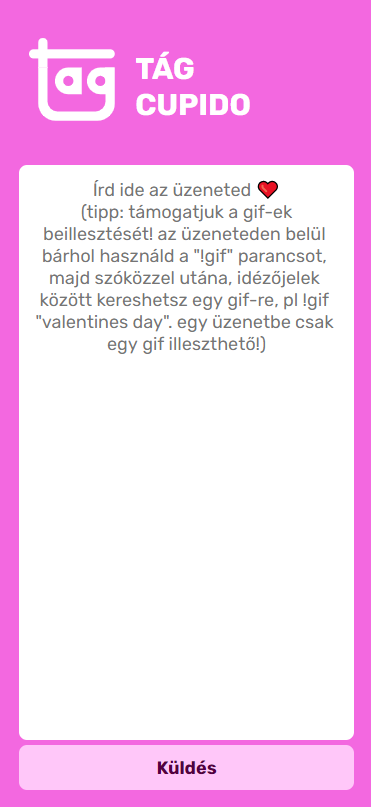
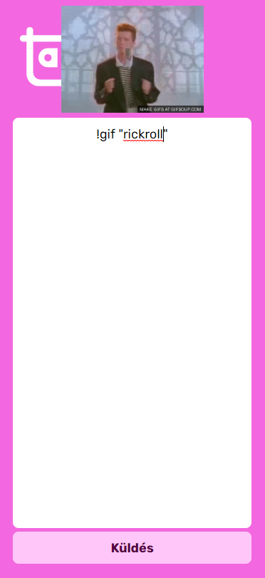
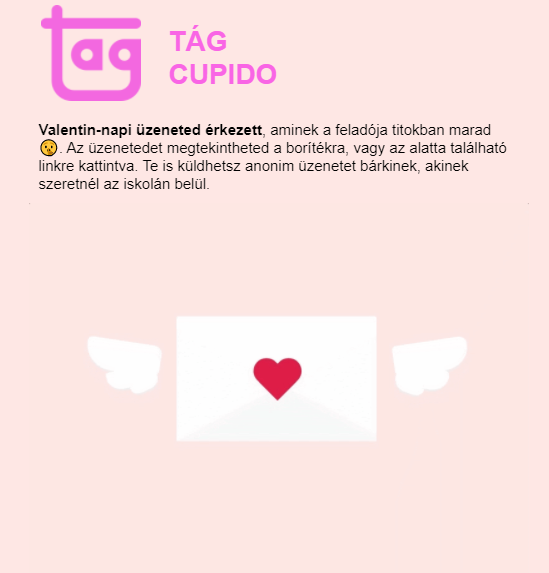

# TÁG Cupido

Iskolánkban hagyomány a Valentin-napi titkos üzenetküldés. Idén ezt online kellett megvalósítanunk, ezért készítettem ezt az oldalt egy osztálytársammal együtt. Az egészet egy hétvége alatt dobtuk össze és nem használtunk githubot, a gépem újratelepítésekor elvesztek a forrásfájlok :(

A weboldal React-el készült és a Firebase adatbázisába mentette az üzeneteket. Az email címek autocomplete funkciója és a gifek lekérése Tenorról egy Herokun hosztolt Express szerver segítségével történt. Február 14-e reggelén nyitottuk meg az oldalt, este pedig egy node script egyszerre küldte el az emaileket mindenkinek Mailgun-on keresztül.

## Néhány képernyőkép a kész projektről:

Így néztek ki a kiküldött emailek:

